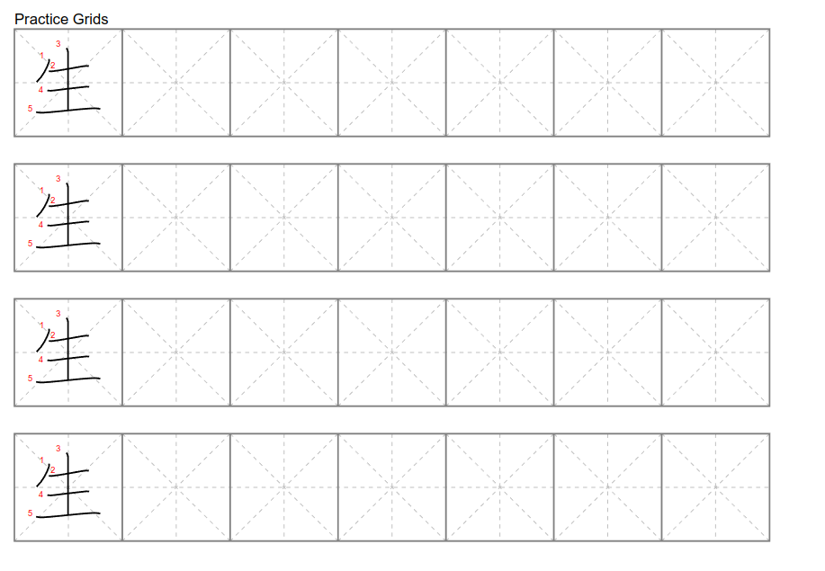
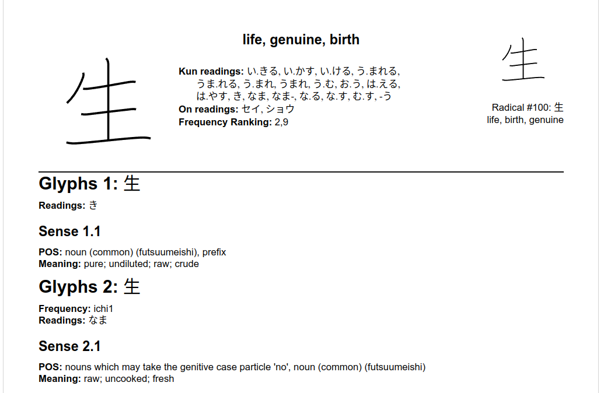
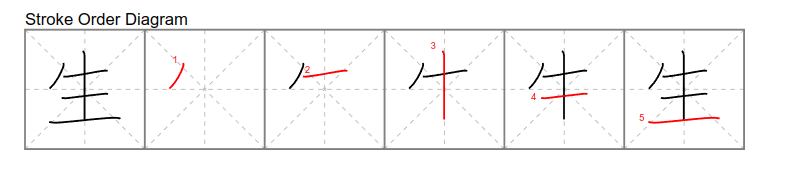

<p align="center">
  
</p>

# Kanji Time!

**Kanji Time is an extensible tool that instantly generates custom, printable kanji study sheets and dictionary summaries.**

Kanji Time is also a powerful launching platform for plug-in database-to-PDF report execution.

Today Kanji Time generates Japanese language learning aids... with future-forward design and plug-in reporting, tomorrow's possibilities for Kanji Time are limitless!

---

## What sets Kanji Time apart?

* **On-demand, from-the-command-line:** Type one command, get a professional-quality practice sheet for any kanji.
* **Plug-in reporting:** Add new study aids or analytics reports by simply dropping in a Python module — there’s no need to change the core codebase.
* **Built for learners and builders:** This tool is my daily study companion *and* a living case study for teaching robust software engineering.

[Jump straight to the install guide.](#build--run)

---

## Sample Study Aids

The artifacts that you see here were produced by Kanji Time's own pipeline from [raw data](docs/source/open_data.rst) to PDF output.

**These artifacts are not just throwaway demos! They power real world Japanese study.**

<table>
  <tr>
    <th>Practice Sheet</th>
    <th>Kanji Summary</th>
  </tr>
  <tr>
    <td align="center">
      <br>
      <sub>Sample ruled cells for kanji penmanship practice in the Practice Sheet report</sub>
    </td>
    <td align="center">
      <br>
      <sub>Extract from page 1 of a sample Kanji Summary report</sub>
    </td>
  </tr>
  <tr>
    <td align="center">
      <br>
      <sub>Sample kanji stroke-order diagram in the Practice Sheet report.</sub>
    </td>
    <td></td>
  </tr>
</table>

See these sample full-sized!
[Kanji Summary Report (PDF)](docs/source/_static/kanji_summary_sample.pdf) and [Practice Sheet (PDF)](docs/source/_static/practice_sheet_sample.pdf) are the full-sized PDF files generated by Kanji Time that sourced the above images.

Better yet, [install and run Kanji Time right now and see for yourself!](#build--run)

---

## Built for Today, Designed for Tomorrow.

Here's what Kanji Time delivers today... and why it's built to handle tomorrow's challenges too:

### Key Features

* **Printable, customizable kanji study sheets**
  Instantly generate practice sheets for any kanji, with stroke order and radical cross-referencing.

* **Extensible plug-in architecture**
  Add new reports or data sources by simply dropping in a new Python package—no changes to the core code required.

* **Separation of data and presentation**
  Decouples data acquisition from layout and rendering for maximum flexibility and maintainability.

* **Robust PDF output**
  Clean, reliable, and professional-quality print artifacts, not just digital displays.

* **Command-line simplicity**
  Usable by anyone with no advanced setup and no dependencies beyond Python.

* **First-class documentation and testing**
  Designed as a model for software engineering students and professionals alike.

* **Real-world proven**
  Used routinely for Japanese study, and as a code case-study example for teaching Python.

### Technical Features

* **Protocol-based architecture**
  Core interfaces (e.g., `RenderingFrame`, `PageController`) are defined with Python protocols (PEP 544), ensuring plug-in compatibility and future-proof extensibility.

* **Comprehensive frame and layout library**
  Includes reusable layout frames—containers, formatted text, SVG and ReportLab drawing, page rules, horizontal/vertical stacks, and more.

* **Advanced geometry modeling**
  Built on robust geometric primitives:

  * **Distance:** A unit-aware, immutable value type for working with points, dimensions, and scaling—enabling precise layout, alignment, and measurement across all outputs.
  * **Pos, Extent, Region:** Compose cleanly with Distance to represent positions, bounding boxes, and page areas for flexible and reliable layout math.
  * **Anchor points and stacking strategies:** Provide responsive, scalable arrangement of all content, whether text or vector graphics.

* **Native SVG support**
  Seamlessly renders KanjiVG glyphs and other vector data alongside formatted text in both PDF and on-screen outputs.

* **Dynamic module loading**
  Reports are loaded at runtime using Python's import system, allowing truly modular development and deployment of new report types.

* **Robust test coverage**
  Core data, geometry, layout, and rendering modules are covered by automated tests for reliability and maintainability.

* **Clean, Sphinx-based documentation**
  Public APIs, data contracts, and architectural diagrams are fully documented and cross-referenced for easy developer onboarding and future extension.

---

## Build & Run

### Setup: Build and Install Locally

1. **Create and activate a virtual environment (recommended):**

   ```bash
   python -m venv .venv
   source .venv/bin/activate        # On Windows: .venv\Scripts\activate
   ```

2. **Install build tools** (only needed if you want to build the wheel yourself):

   ```bash
   pip install build
   ```

3. **Build the wheel (optional, for local packaging):**

   ```bash
   python -m build
   ```

   This will create a `.whl` file in the `dist/` directory.

4. **Install Kanji Time and its runtime dependencies:**

   ```bash
   pip install -r requirements.txt
   pip install dist/kanji_time-*.whl    # if you built the wheel in step 3
   ```

   *Alternatively, you can install directly from source for development:*

   ```bash
   pip install -e .
   ```

5. **(Optional) For development and testing, also install dev requirements:**

   ```bash
   pip install -r dev_requirements_only.txt
   ```

6. **(Optional) To build or test documentation, install docs requirements:**

   ```bash
   pip install -r docs_requirements_only.txt
   ```

### Run

Generate kanji reports from the command line:

```bash
python -m kanji_time 現 生 鳥 --report=kanji_summary --report=practice_sheet
```

* This will process the characters `現`, `生`, and `鳥`, and produce PDF outputs and execution logs.
* Look for PDF files and logs named like:

```
Beginning kanji_summary.
Processing 現...on page...1...done! PDF result in 96_現_summary.pdf
Processing 生...on page...1...2...3...done! PDF result in 100_生_summary.pdf
Processing 鳥...on page...1...done! PDF result in 196_鳥_summary.pdf
kanji_summary complete.
Finished.  Execution log in kanji_summary.log
Beginning practice_sheet.
Processing 現...on page...1...done! PDF result in 現_practice.pdf
Processing 生...on page...1...done! PDF result in 生_practice.pdf
Processing 鳥...on page...1...done! PDF result in 鳥_practice.pdf
practice_sheet complete.
Finished.  Execution log in practice_sheet.log
```

* **Output files**: Each processed kanji will have its own summary and/or practice sheet PDF in the current directory.

### Notes

* **Virtual environments are strongly recommended** to avoid polluting your system Python.
* **You do not need to install `build` in your main requirements.txt**—it’s only needed for packaging, not for running Kanji Time.
* **Development and documentation requirements** are separated for clarity—install them only if you want to run tests or build the docs.
* **If you only want to run the program, you can skip steps 2–3 and just install from source:**

  ```bash
  pip install -r requirements.txt
  ```

---

## Documentation

Full documentation will be available soon. RST files are under final review in the 'docs' directory.

Watch this space for a ReadTheDocs or GitHub Pages link!

---

## Solving Today's Problem...

Kanji Time isn't vaporware — the fundamental architecture is *already in place* for creating clean pipelines from raw data to PDF output.

The proof is in front of you.

As of right now, Kanji Time is a valuable tool that assists me — a student of Japanese kanji — with printable PDF practice sheets and kanji dictionary summaries cross-referenced by the kanji's traditional radical.
These reports are generated on-demand from the Kanji Time command line for any kanji character that I want to study.

*This tool powers my own Japanese studies, helping me track progress, drill difficult characters, practice penmanship, and keep all my learning artifacts organized.*

---

## ... While Planning for Tomorrow's Problems ...

The design of Kanji Time was set from day 1 with **useful extensibility** as one of its major objectives.

It was not enough for me to create one-off exercise sheets: I could do that well enough with a Jupyter notebook.

I wanted a simple, *easily reusable* and intuitive codebase—an easy-to-understand, general-purpose layout tool that **completely decouples** the act of data acquisition from the act of data presentation.

Simplicity, ease of use, and, most of all, utility, are the driving forces behind the Kanji Time design philosophy.

The net result is a robust, reusable platform for framing text and vector graphics on a page, automatically laying out framed page elements, and paginating the output—all while keeping code that generates a report completely isolated from the code in these supporting presentation artifacts.

This isolation enables Kanji Time to use Python's dynamic module loading capabilities so that adding a new report is as simple as dropping in and whitelisting the Python package that generates it.

---

## ... And Setting A Good Example

The second design objective for Kanji Time was set to be a case study for my [Code in Place](https://codeinplace.stanford.edu/) students learning Python.

* I wanted an easy-to-understand console application that was more than a toy that I could present to other Section Leaders and my Section students.
* The program had to be large enough to be interesting yet small enough to fit inside your head comfortably.
* The program had to avoid complex libraries or little understood Python constructs.
* Above all else, the program had to *solve a useful and relatable problem*.

The result is *Kanji Time*, a surprisingly powerful, useful, and compact application built out of simple components and algorithms in a couple of lines of code.

Kanji Time doesn't just demonstrate good programming practices and the art of making design trade-offs.
It also fosters respect for good programming habits such as first-class documentation, comprehensive test suites, and rock-solid code hygiene.

Beyond these, the best lesson inside Kanji Time is that **it is not perfect.**

Kanji Time demonstrates that code does not need to be perfect to ship—but one does need to be smart about what imperfections to ship and have a plan to correct them.

---

[Install Kanji Time now!](#build--run)
